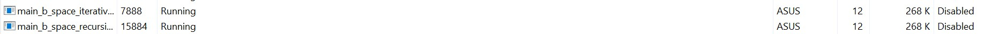

# Fibonacci

## Table of contents
* [About](#about)
* [Fibonacci Iterative](#Fibonacci_Iterative)
* [Fibonacci Recursive](#Fibonacci_Recursive)
* [To Run](#To_Run)
* [Output](#Output)

## About:
The fibonacci sequence is a set of integer in which each number is the sum of the two that precede it. The sequence looks like this: 0, 1, 1, 2, 3, 5, 8, 13, 21, 34, and so on forever. The Fibonacci sequence can be described using a mathematical equation: Xn+2= Xn+1 + Xn

To calculate Fibonacci number, we can use two method: Iterative and Recursive

## Fibonacci Iterative:

a. Fibonacci series using Iterative (using for loop)

```
int fibonacciIterative(int N){
    int num1=0;
    int num2=1;
    int output;

    if (N==0) {
        return num1;
    } else if (N==1){
        return num2;
    } else {
        for (int i = 2; i<= N; i++){ 
            output = num1+num2;
            num1 = num2;
            num2 = output;
        }
        return output;
    }
}
```

## Fibonacci Recursive:

b. Fibonacci series using Recursive (using if else)

```
int fibonacciRecursive (int N){
    if (N==0){
        return 0;
    } else if (N==1){
        return 1;
    } else {
        return fibonacciRecursive(N - 1) + fibonacciRecursive(N-2);
    }
}
```


## To run:
```
make run
./main.exe
```

## Output:
```
The fibonacci number for 10 is 55
The fibonacci number for 10 is 55
The fibonaaci number F0 = 0 = 0
The fibonaaci number F1 = 1 = 1
The fibonaaci number F2 = 1 = 1
The fibonaaci number F3 = 2 = 2
The fibonaaci number F4 = 3 = 3
The fibonaaci number F5 = 5 = 5
The fibonaaci number F6 = 8 = 8
The fibonaaci number F7 = 13 = 13
The fibonaaci number F8 = 21 = 21
The fibonaaci number F9 = 34 = 34
The fibonaaci number F10 = 55 = 55
```

# Benchmark (Time Complexity)

## Table of contents
* [Fibonacci Time Iterative](#Fibonacci_Time_Iterative)
* [Fibonacci Time Recursive](#Fibonacci_Time_Recursive)
* [To Run](#To_Run)
* [Output](#Output)

## Fibonacci Time Iterative:
```
#include <stdio.h>
#include <time.h>
#include "mylib/mylib.h"

int main()
{
    int n = 10;
    int c;
    int i = 0;
    clock_t t;
    t = clock();
    for (c=2; c<=n; c++)
    {
        printf("%d\n",fibonacciIterative(i));
        i++;
    }
    t = clock()-t;
    double time_taken = ((double)t)/CLOCKS_PER_SEC;
    printf("Time taken: %f", time_taken);
    return 0;
}
```

## Fibonacci Time Recursive:
```
#include <stdio.h>
#include <time.h>
#include "mylib/mylib.h"

int main()
{
    int n = 10;
    int c;
    int i = 0;
    clock_t t;
    t = clock();
    for (c=2; c<=n; c++)
    {
        printf("%d\n",fibonacciRecursive(i));
        i++;
    }
    t = clock()-t;
    double time_taken = ((double)t)/CLOCKS_PER_SEC;
    printf("Time taken: %f", time_taken);
    return 0;
}
```

## To run:
```
Time Recursive:
make time
./main_b_time_recursive.exe

Time Iterative:
make time
./main_b_time_iterative.exe
```

## Output:
```
Time Recursive:
0
1
1
2
3
5
8
13
21
Time taken: 0.006000

Time Iterative:
0
1
1
2
3
5
8
13
21
Time taken: 0.008000
```

# Benchmark (Space Complexity)

## Table of contents
* [Fibonacci Space Iterative](#Fibonacci_Space_Iterative)
* [Fibonacci Space Recursive](#Fibonacci_Space_Recursive)
* [To Run](#To_Run)
* [Output](#Output)

## Fibonacci Space Iterative:
```
#include <stdio.h>
#include "mylib/mylib.h"

int main (void) {

    int a;

    while (1) {
        a = fibonacciIterative(1000);
        }

    return 0;

}
```

## Fibonacci Space Recursive:
```
#include <stdio.h>
#include "mylib/mylib.h"

int main (void) {

    int a;

    while (1) {
        a = fibonacciRecursive(1000);
        }

    return 0;

}
```

## To run:
```
Space Iterative:
make space
./main_b_space_iterative.exe

Space Recursive:
make space
./main_b_space_recursive.exe
```
## Output:
it works as follows.
